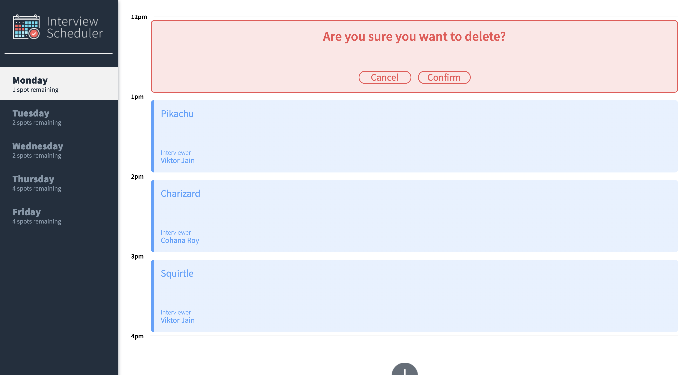
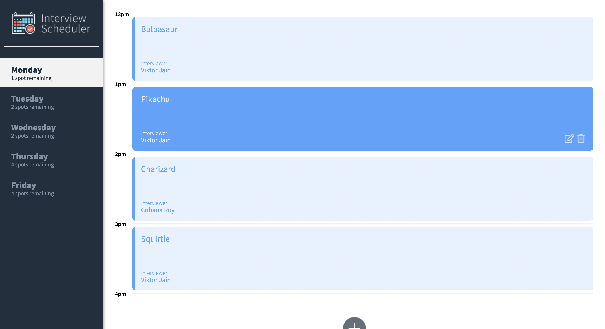

# Interview Scheduler

<li>Interview Scheduler is a single page application built using React.</li>
<li>The user has the ability to <strong>create</strong>, <strong>view</strong>, <strong>cancel</strong>, and <strong>delete</strong> the appointments on the application.</li>

## Tech Stack:

<li>React</li>
<li>Webpack, Babel</li>
<li>Axios</li>
<li>Storybook, Webpack Dev Server, Jest, Testing Library</li>

## Screenshots




# Instructions

## Setup

Install dependencies with `npm install`.

## Running Webpack Development Server

```sh
npm start
```

## Running Jest Test Framework

```sh
npm test
```

## Running Storybook Visual Testbed

```sh
npm run storybook
```
